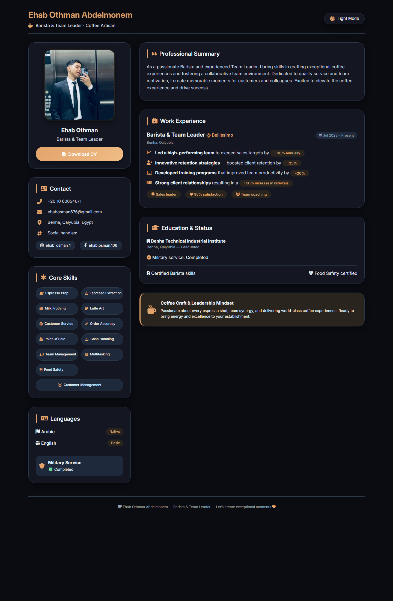

# Ehab Othman Portfolio

A responsive personal portfolio website for **Ehab Othman Abdelmonem**, presenting his profile as a **Barista & Team Leader** with contact details, work experience, skills, education, and downloadable CV.

<p align="center">
  
</p>

## Overview

This project is a single-page portfolio website built with plain HTML, CSS, and JavaScript.  
It is designed to look polished on desktop and mobile screens, and it includes social sharing metadata so the profile looks better when the link is shared.

## Features

- Fully responsive layout for desktop, tablet, and mobile
- Personal profile card with image and CV download button
- Contact section with phone, email, location, and social links
- Organized skills section optimized for smaller screens
- Work experience and education cards
- Dark mode toggle with saved theme preference
- Social preview metadata for link sharing
- Custom favicon support

## Project Structure

```text
.
|-- assets/
|   `-- site-preview.png
|-- Ehab CV.pdf
|-- favicon.webp
|-- img.webp
|-- index.html
`-- README.md
```

## Preview Locally

Open `index.html` directly in the browser, or run a small local server:

```bash
python -m http.server 4173
```

Then open:

```text
http://127.0.0.1:4173
```

## Included Assets

- `img.webp`: profile image used inside the website and social preview metadata
- `favicon.webp`: browser tab icon
- `Ehab CV.pdf`: downloadable CV file
- `assets/site-preview.png`: screenshot used in this README

## Customization

You can quickly update the portfolio by editing `index.html`:

- Change personal information in the header and contact section
- Replace `img.webp` with a newer profile image if needed
- Replace `Ehab CV.pdf` with an updated resume
- Update metadata inside the `<head>` section for deployment on a real domain
- Adjust colors, spacing, and typography from the internal CSS block

## Deployment Note

For the best social sharing preview on WhatsApp, Facebook, LinkedIn, and X, update the metadata image and URL values in `index.html` to use absolute production links after deployment.

Example:

```html
<meta property="og:image" content="https://your-domain.com/img.webp">
```

## Contact

- Instagram: `https://www.instagram.com/ehab_osman_1`
- Facebook: `https://web.facebook.com/ehab.osman.106`
- Email: `ehabosman676@gmail.com`
- Phone: `+20 10 60654071`

## Credits

Created by **Abdelaziz Sleem**  
Website: `https://abdelaziz-sleem.vercel.app/`

بواسطة **عبدالعزيز سليم**
